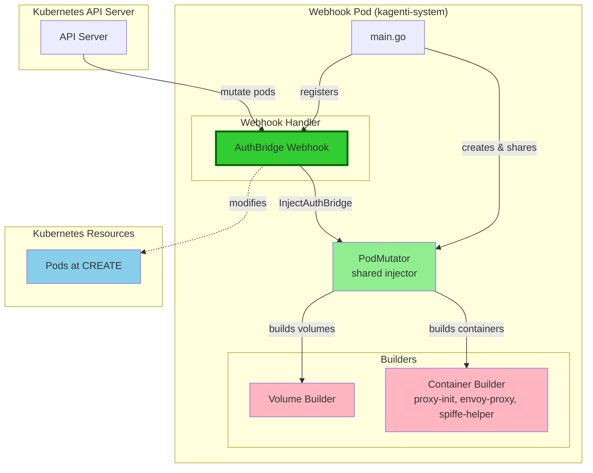
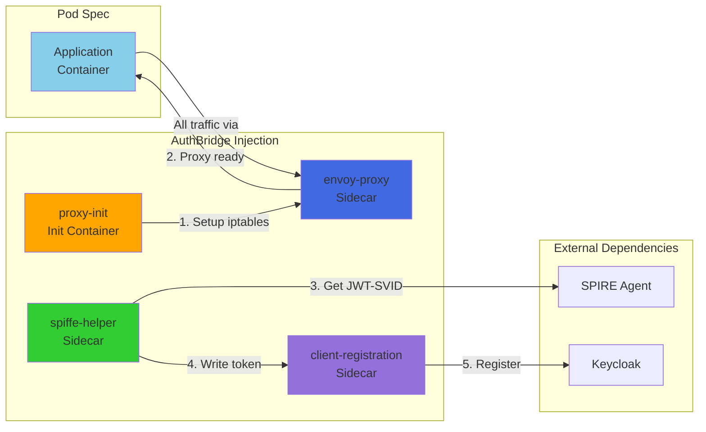
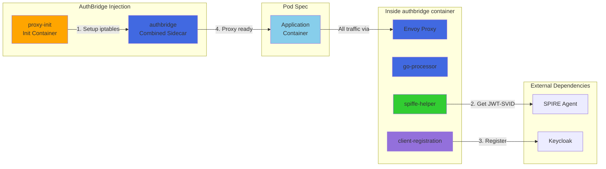
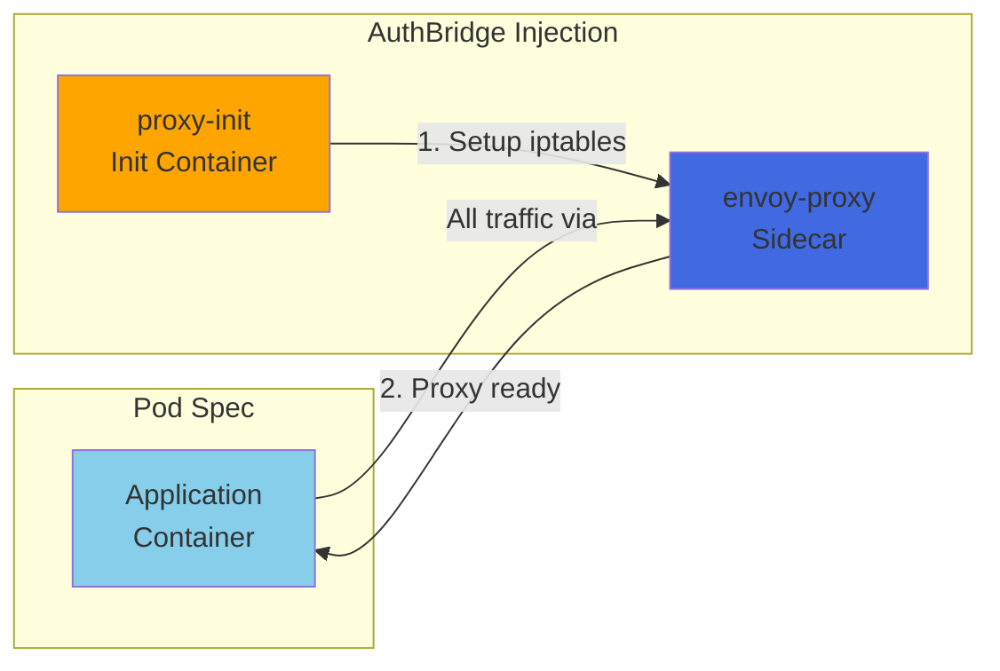
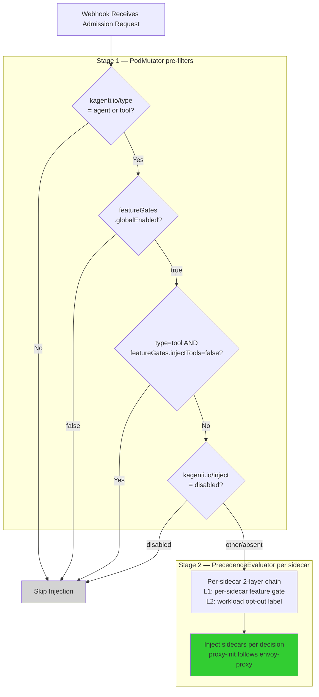

# Kagenti Webhook Architecture

This document provides Mermaid diagrams illustrating the webhook architecture.

## Component Architecture

## Container Injection Flow

### Default (all sidecars injected)

All four sidecars are injected when no opt-out labels are present:

### Combined mode (`featureGates.combinedSidecar: true`)

All sidecars are merged into a single `authbridge` container:

### Without SPIRE (opt-out via `kagenti.io/spiffe-helper-inject: "false"`)

When spiffe-helper is disabled, only envoy-proxy and proxy-init are injected:

## Injection Decision Flow

## Sidecar Injection Rules

### Stage 1 pre-filters (all-or-nothing)

| # | Check | Label / Config | Skip condition |
| --- | --- | --- | --- |
| 1 | Workload type | `kagenti.io/type` on workload | Not `agent` or `tool` |
| 2 | Global kill switch | `featureGates.globalEnabled` in Helm values | `false` |
| 3 | Tool gate | `featureGates.injectTools` in Helm values | Type is `tool` AND gate is `false` (default) |
| 4 | Whole-workload opt-out | `kagenti.io/inject: disabled` on workload | Label explicitly set |

### Stage 2 per-sidecar chain (independent per sidecar)

| Layer | Config | Effect |
| --- | --- | --- |
| 1. Per-sidecar feature gate | `featureGates.envoyProxy / .spiffeHelper / .clientRegistration` | Disables sidecar cluster-wide |
| 2. Workload opt-out label | `kagenti.io/envoy-proxy-inject: "false"` etc. on pod template | Disables sidecar for that workload |

`proxy-init` is not independently evaluated — it always mirrors the `envoy-proxy` decision.

### Combined sidecar mode

| Config | Default | Effect |
| --- | --- | --- |
| `featureGates.combinedSidecar` | `false` | When `true`, injects a single `authbridge` container instead of separate `envoy-proxy` + `spiffe-helper` + `kagenti-client-registration` containers. `proxy-init` is still a separate init container. Per-sidecar gates/labels control flags passed to the combined entrypoint. |
